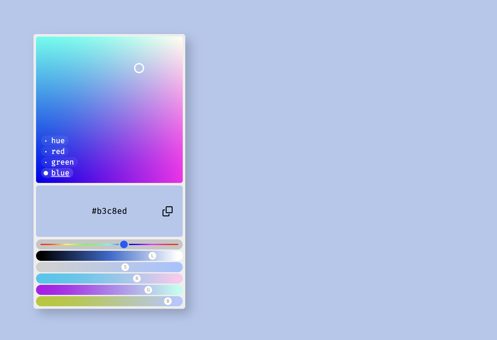

# Color Xplr
It's a color picker for the browser. But a cool one.

## Features:
- 4 "plane" modes: hue, red, green, blue (for inspiration)
- "copy to clipboard" button
- hue, luminosity, saturation, red, green & blue sliders (for fine control over tint).
- modal handling: "align" mode & "stay inside window" position