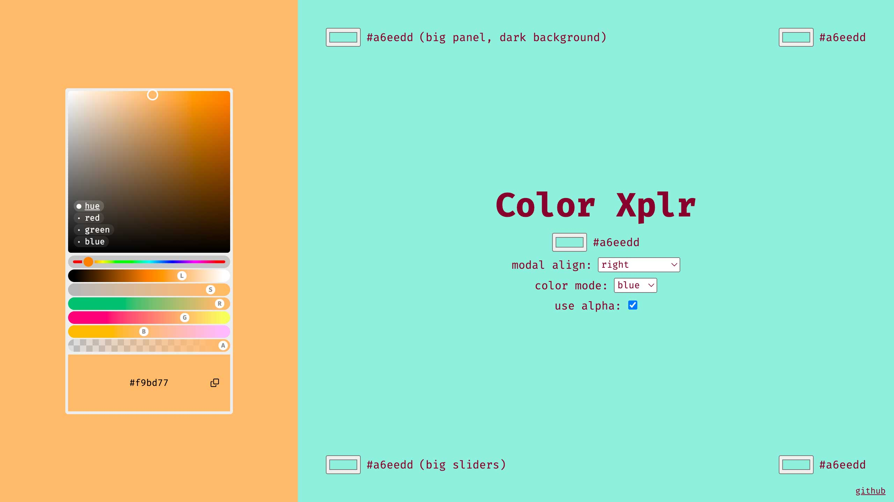

# Color Xplr
It's a funky-damn-cool color explorer (in the browser) for frustrated creatives. 

It's not a picker, it's an explorer.

[Here's a demo.](https://jniac.github.io/color-xplr/test/vanilla/)

<a href="https://jniac.github.io/color-xplr/test/vanilla/">
  
</a>

## Features:
- 4 "plane" modes: hue, red, green, blue (for inspiration)
- "copy to clipboard" button
- hue, luminosity, saturation, red, green & blue sliders (for fine control over tint).
- modal position: "align" mode & "stay-inside-window" feature

## About

Pure modern ES / dom library, no dependency.

## Dev
```
yarn dev
```
