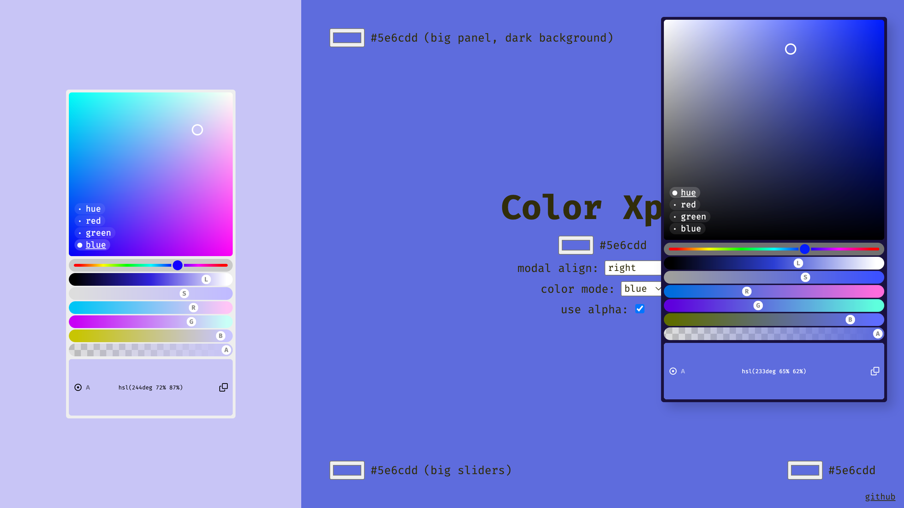

# Color Xplr
It's a funky-damn-cool color explorer (in the browser) for frustrated creatives. 

It's not a picker, it's an explorer.

[Here's a demo.](https://jniac.github.io/color-xplr/test/vanilla/)

<a href="https://jniac.github.io/color-xplr/test/vanilla/">
  
</a>

[VERSION.md](./VERSION.md)

## Features:
- 4 "plane" modes: hue, red, green, blue (for inspiration)
- "copy to clipboard" button
- easy paste (do not have to focus the input)
- hue, luminosity, saturation, red, green & blue sliders (for fine control over tint).
- modal position: "align" mode & "stay-inside-window" feature
- string mode: 
  - [keywords](https://developer.mozilla.org/en-US/docs/Web/CSS/named-color)
    - `red`
    - `rebeccapurple`
  - hex: 
    - `#f9bd77`
    - `#f9bd77ff`
  - rgb: 
    - `rgb(249 189 119)`
    - `rgba(249 189 119 / 100%)`
  - hsl: 
    - `hsl(32deg 92% 72%)`
    - `hsla(32deg 92% 72% / 100%)`
  - glsl: 
    - `vec3(0.98, 0.74, 0.47)`
    - `vec4(0.98, 0.74, 0.47, 1.00)`

## About

Pure modern ES / dom library, no dependency.

## Dev
```
yarn dev
```
